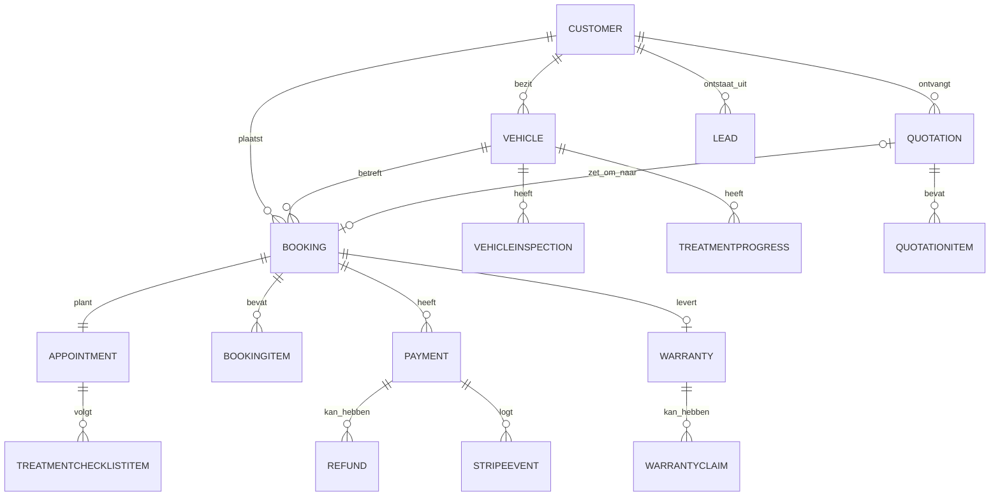
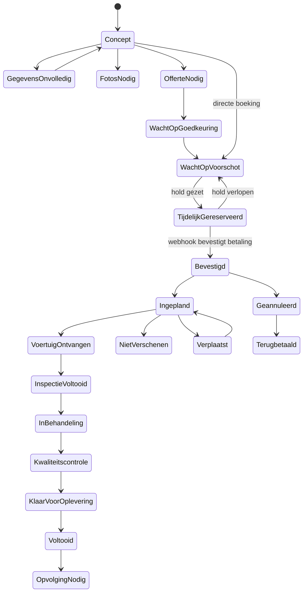
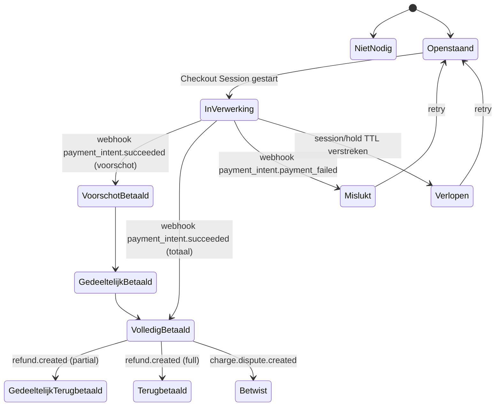

# Fase 1 — Audit & Architectuur
### X-quisite Car Detailing — platform (website, CRM, boekingssysteem, Stripe)

Status: **concept, ter goedkeuring**. Er is in deze fase geen applicatiecode geschreven — conform de opdracht ("begin niet willekeurig met losse pagina's of componenten voordat architectuur, database, boekingslogica, Stripe-logica en migratiestrategie zijn vastgesteld").

> **Legenda aannames:** overal waar dit document een aanname doet in plaats van een geverifieerd feit, staat de tag `[AANNAME]`. Niets met deze tag mag als bewezen bedrijfsinformatie de website in gaan (conform sectie 47/54 van de opdracht) totdat het is bevestigd.

---

## 0. Belangrijke beperking bij deze audit

Ik heb geprobeerd `https://www.xquisitedetailing.nl` en een aantal onderliggende pagina's (`/over-ons`, `/diensten`, externe vermeldingen) direct op te halen. Dit werd geblokkeerd met **HTTP 403** — vermoedelijk bot-bescherming van het Squarespace-platform tegen het proxy-verkeer van deze omgeving, niet iets aan uw kant.

Ik kon wél betrouwbare informatie verzamelen via geïndexeerde zoekresultaten (paginatitels, meta-omschrijvingen en samenvattingen van Google's index). Dat is voldoende voor een eerste audit, maar **niet** voldoende om exacte huidige teksten, prijzen, contactgegevens of juridische pagina's (privacyverklaring, algemene voorwaarden) 1-op-1 over te nemen.

**Wat ik nodig heb van u om de contentinventarisatie (item 2) en het migratieplan (item 15) af te ronden:**
- Exporteer of kopieer de tekst van: home, over ons, diensten, alle dienst-detailpagina's, prijzen/pakketten, privacyverklaring, algemene voorwaarden, contactpagina.
- Exacte contactgegevens (telefoon, e-mail, KvK, btw-nummer, adres studio Roden).
- Huidige Instagram/Facebook-links en of deze actief gebruikt worden.
- Een lijst van alle huidige URL's (bijv. via de Squarespace-sitemap `xquisitedetailing.nl/sitemap.xml`) zodat het redirectplan (item 15) compleet is.

Zodra ik dat heb, werk ik secties 1, 2 en 15 bij met exacte gegevens. Alles hieronder gebruikt tot die tijd wat via zoekresultaten geverifieerd kon worden, aangevuld met gelabelde aannames.

---

## 1. Samenvatting van de huidige website

**Geverifieerd via zoekresultaten (Google-index van xquisitedetailing.nl):**

| Aspect | Bevinding |
|---|---|
| Platform | Squarespace |
| Positionering | "Autopoetsbedrijf Groningen" / mobiele car detailing |
| Regio | Groningen, met vermeldingen van Drenthe en Friesland |
| Kernboodschap | Detailing "op locatie", men komt naar de klant met een uitgerust mobiel busje |
| Oprichter | Jarno |
| Slogan/positionering in copy | "Passie voor perfectie" (pagina over-ons) — dit is **niet** dezelfde slogan als de officiële "Waar kwaliteit geen toeval is, maar een keuze!" die in deze opdracht is aangeleverd; behandel de laatste als leidend |
| Diensten | Exterieur- en interieurreiniging, polijsten, keramische coating, combinatiepakketten (interieur + exterieur in één afspraak) |
| Prijsmodel | Klasse-gebaseerd: vanaf-prijs op kleinste voertuigklasse (stadsauto), toeslag per klasse, vaste extra prijs per pakket (Standaard/Deluxe/Premium), toeslag geldt maar één keer bij combinatiepakketten |
| Bekende pagina's | `/`, `/diensten`, `/polijsten`, `/auto-detailing-autoreiniging-groningen`, `/over-ons` |
| Reviews | Externe vermelding (BesteAutopoetser.nl) noemt een Google-rating van 5.0 op basis van 40 reviews `[ongeverifieerd, derde partij]` |
| Studio in Roden | **Niet aangetroffen** in de huidige site-index — dit lijkt een uitbreiding die nog niet op de huidige site staat, consistent met de opdracht die stelt dat de huidige site vooral mobiel gericht is |

**Niet gevonden / niet toegankelijk (moet u aanleveren, zie sectie 0):**
- Exacte huidige prijzen per behandeling/pakket
- Exacte contactgegevens (telefoon, e-mail, adres)
- Volledige tekst van privacyverklaring en algemene voorwaarden
- Actuele social media-links
- Exacte huidige sitemap/URL-structuur

---

## 2. Wat behouden moet blijven vs. herschreven/verwijderd moet worden

Onderstaande is een voorlopige indeling op basis van wat we weten; definitief te bevestigen zodra de volledige content is aangeleverd.

### Behouden (kern, waarschijnlijk herbruikbaar na redactie)
- Kernonderscheid: maatwerk, precisie, persoonlijke aanpak (past bij premium positionering opdracht)
- Bestaand dienstenaanbod als basis: exterieur, interieur, polijsten, keramische coating, combinatiepakketten
- Regionale focus Groningen/Drenthe/Friesland — uit te breiden met Roden als vestigingslocatie
- Klasse-gebaseerd prijsmodel (vanafprijs + voertuigklasse-toeslag + pakkettoeslag) — dit principe sluit goed aan bij de gevraagde prijsengine (sectie 15 van de opdracht) en wordt de basis voor `VehicleClass` + `PricingRule`
- Bestaande Google-reviews (indien geverifieerd en met toestemming overneembaar via Google Business Profile-koppeling, niet als losse tekst gekopieerd)

### Herschrijven
- Alle copy die uitsluitend "mobiele detailing" communiceert → wordt "studio in Roden **en** behandeling op locatie"
- Slogan-gebruik: overal waar "Passie voor perfectie" of vergelijkbare varianten worden gebruikt als primaire tagline, vervangen door de officiële slogan uit deze opdracht
- Eventuele niet-onderbouwde kwaliteitsclaims → herschrijven naar eerlijke, voorwaardelijke taal (conform sectie 2 van de opdracht: resultaat hangt af van lakconditie, beschadigingstype, etc.)
- Prijsvermeldingen → verplaatsen van statische tekst naar door de prijsengine berekende, altijd actuele bedragen

### Vermoedelijk verouderd of te verwijderen
- Squarespace-specifieke paginastructuren/URL's die niet passen bij de nieuwe sitemap (item 4) — deze krijgen 301-redirects, zie migratieplan
- Losse contactformulieren zonder CRM-koppeling → vervangen door leadformulier/boekingswizard die rechtstreeks in het CRM landt

### Niet zonder toestemming/toegang over te nemen
- Squarespace-CMS-content (geen API-toegang totdat u inloggegevens of een export aanlevert)
- Bestaande domeinregistratie/DNS (nodig voor cutover, zie roadmap)
- Bestaande Google Business Profile (nodig voor JSON-LD-koppeling en reviews)
- Eventuele bestaande klant- of factuurdata in andere systemen (bijv. boekhoudpakket) — alleen migreren met expliciete data-export en toestemming

---

## 3. Nieuwe sitemap

```
/                                          Home
/diensten                                  Overzicht diensten
/diensten/interieurreiniging
/diensten/exterieurreiniging
/diensten/enkelstaps-polijsten
/diensten/meerstaps-lakcorrectie
/diensten/keramische-coating
/diensten/gyeon-coating
/diensten/koplamprestauratie
/diensten/cabriodak-reiniging-impregneren
/diensten/geurbehandeling-ozonbehandeling
/diensten/motorruimtebehandeling
/diensten/lease-inleverbehandeling
/diensten/onderhoudsbehandeling
/diensten/fresh-and-clean
/pakketten                                 Pakketten-vergelijker
/prijzen                                   Prijsopbouw / vanafprijzen
/projecten                                 Portfolio (filterbaar)
/projecten/[slug]                          Projectdetail
/voor-en-na                                Losse voor/na-galerij (kan ook subset van /projecten zijn)
/reviews
/over-ons
/werkwijze
/detailingstudio-roden
/mobiele-detailing
/werkgebied
/werkgebied/[plaats]                       Alleen voor plaatsen met unieke content (zie SEO, item 14)
/zakelijk
/veelgestelde-vragen
/kennisbank                                Blog/kennisbank
/kennisbank/[slug]
/contact
/offerte-aanvragen
/boeken                                    Boekingswizard
/inloggen
/mijn-account/...                          Klantenportaal (beveiligd, noindex)
/garantievoorwaarden
/algemene-voorwaarden
/privacyverklaring
/cookiebeleid

--- interne routes, noindex ---
/admin/...                                 CRM (beveiligd, noindex)
/api/...                                   Server routes (webhooks, acties)
```

Geen aparte dunne pagina per stad zonder unieke inhoud — `/werkgebied/[plaats]` wordt alleen aangemaakt voor Roden, Groningen, Assen, Leek, Drachten wanneer er per plaats echt unieke content is (lokale projecten, specifieke bereikbaarheidsinfo), conform sectie 36 van de opdracht.

---

## 4. Technische architectuur (overzicht)

```
┌─────────────────────────────────────────────────────────────────┐
│  Vercel (Next.js App Router, TypeScript)                        │
│  ┌───────────────┐  ┌───────────────┐  ┌───────────────────┐   │
│  │ Publieke site  │  │ Klantenportaal│  │ CRM (/admin)       │   │
│  │ RSC + ISR      │  │ RSC + Client  │  │ RSC + Client       │   │
│  └───────┬───────┘  └───────┬───────┘  └─────────┬─────────┘   │
│          │                  │                     │             │
│          └──────────────────┴─────────────────────┘             │
│                          Server Actions / Route Handlers         │
│               (validatie: Zod · autorisatie: server-side)        │
└───────────────────────────┬───────────────────────────────────┬─┘
                             │                                   │
                    ┌────────▼─────────┐                ┌───────▼───────┐
                    │ Supabase          │                │ Stripe         │
                    │ - Postgres        │                │ - Checkout/PI  │
                    │ - Auth            │                │ - Webhooks     │
                    │ - Storage (foto's,│                └───────┬───────┘
                    │   documenten)     │                        │
                    │ - Row Level Sec.  │                        │
                    └────────┬──────────┘                        │
                             │                                   │
              ┌──────────────┼───────────────────────────────────┘
              │              │
      ┌───────▼──────┐ ┌─────▼─────┐ ┌───────────────┐ ┌───────────────┐
      │ Resend        │ │ Sentry     │ │ Vercel Cron    │ │ Toekomstig:    │
      │ (transactione-│ │ (errors)   │ │ (herinneringen,│ │ Moneybird,     │
      │ le e-mail)    │ │            │ │ verlopen holds)│ │ Google Cal.,   │
      └───────────────┘ └────────────┘ └───────────────┘ │ WhatsApp API,  │
                                                          │ RDW-lookup     │
                                                          └───────────────┘
```

**Kernprincipes** (uitwerking van sectie 5 van de opdracht):
- Server Components als standaard; Client Components alleen bij interactie (boekingswizard-stappen, agenda drag-and-drop, sliders).
- Alle prijs-, beschikbaarheids- en autorisatielogica draait **uitsluitend server-side** (Server Actions / Route Handlers) — de client stuurt intenties ("boek dit tijdslot"), nooit bedragen of beschikbaarheidsbeslissingen.
- Eén centrale Postgres-database (via Supabase) als bron van waarheid; geen dubbele klant-/voertuigadministraties.
- Stripe-webhooks zijn de enige bron van waarheid voor betaalstatus — nooit de client-side redirect.
- Idempotentie via unieke constraints (`stripeEventId`, `paymentIntentId`) en database-transacties bij het bevestigen van een boeking.
- CRM en publieke site delen hetzelfde datamodel en dezelfde Server Actions-laag — geen aparte "CRM-backend" die uit de pas kan lopen met de boekingsflow.

---

## 5. Aanbevolen stack — met argumentatie

| Keuze | Beslissing | Argumentatie |
|---|---|---|
| Framework | Next.js (App Router) + TypeScript | Vereist door opdracht; goede fit voor RSC/ISR-mix van publieke site + dynamische portalen |
| Database | PostgreSQL via Supabase | Vereist relationele integriteit (70+ gekoppelde modellen, financiële data); Supabase levert DB + Auth + Storage in één, scheelt vendor-overhead |
| **ORM: Prisma** i.p.v. Drizzle | **Prisma** | Voor een domeinmodel van deze omvang (CRM, prijsengine, betalingen, garanties) weegt Prisma's schema-first DX, ingebouwde migratietooling en volwassen relatie-queries zwaarder dan Drizzle's lagere overhead. Nadeel: Prisma's cold start is trager op serverless — mitigatie: Node.js-runtime (geen Edge) voor alle admin/CRM/boeking-routes + connection pooling via Supabase's pooler (of Prisma Accelerate indien nodig). Drizzle blijft een prima alternatief als schrijfsnelheid van migraties later een knelpunt blijkt; de repository-laag wordt zo opgezet dat een latere overstap beperkt blijft tot de data-laag. |
| **Auth: Supabase Auth** i.p.v. Auth.js/Clerk | **Supabase Auth** | Al aanwezig omdat Supabase toch de database/storage-provider is — geen extra vendor. Ondersteunt passwordless e-maillogin (vereist voor klantenportaal, sectie 19), en werkt direct samen met Postgres Row Level Security als extra verdedigingslaag naast applicatie-autorisatie. Clerk is sterker in kant-en-klare UI-componenten maar rekent per MAU — bij een groeiend klantenportaal is dat een structurele kostenpost zonder duidelijke meerwaarde hier. Auth.js vereist meer handwerk om dezelfde RLS-integratie te krijgen. Rollen (Eigenaar/Beheerder/Detailer/Verkoop/Financieel/Alleen-lezen) worden als eigen `Role`/`Permission`-tabellen gemodelleerd, niet als Supabase-metadata, zodat rechten in de business-laag blijven en getest kunnen worden. |
| Validatie | Zod (server én client) | Vereist; enige bron van waarheid voor input-shape, hergebruikt tussen Server Actions en formulieren |
| Formulieren | React Hook Form + Zod resolver | Complexe multi-step boekingswizard vereist stapsgewijze validatie en state-persistentie |
| Betalingen | Stripe (Checkout Sessions / Payment Intents, server-side aangemaakt) | Vereist; iDEAL via Stripe dekt de Nederlandse markt |
| E-mail | Resend | Vereist; goede DX met React Email-templates, past bij Vercel-stack |
| Hosting | Vercel | Vereist |
| Monitoring | Sentry | Vereist voor productie-foutregistratie |
| Tests | Vitest (unit/integratie) + Playwright (E2E) | Vereist; Playwright dekt de volledige boekingsflow end-to-end |
| Styling | Tailwind CSS + shadcn/ui | Praktisch, goed toegankelijk uit de doos, past bij de gewenste strakke/minimalistische huisstijl |
| Animatie | Framer Motion (al aanwezig in repo) | Al in gebruik; subtiele micro-interacties, `prefers-reduced-motion` gerespecteerd |

---

## 6. Datamodel (kernmodellen, samengevat)

De opdracht vraagt ~70 modellen. Hieronder de indeling per domein met kernvelden; het volledige Prisma-schema met alle velden, indexen en constraints wordt in Fase 2 opgeleverd (dat is codewerk, hoort niet in dit architectuurdocument thuis).

| Domein | Modellen |
|---|---|
| Identiteit & rechten | `User`, `Role`, `Permission`, `AdminProfile`, `Employee` |
| Klant | `Customer`, `CustomerAddress`, `CustomerConsent`, `CustomerTag` |
| Voertuig | `Vehicle`, `VehicleImage`, `VehicleInspection`, `PaintMeasurement`, `VehicleClass` |
| Leads/CRM | `Lead`, `LeadActivity`, `LeadSource`, `Task`, `Note`, `ActivityTimeline` |
| Assortiment & prijzen | `Service`, `Package`, `PackageItem`, `AddOn`, `PricingRule`, `DepositRule`, `Promotion`, `DiscountCode` |
| Boeking & agenda | `BookingSession`, `Booking`, `BookingItem`, `Appointment`, `AppointmentHold`, `AvailabilityRule`, `BlockedDate`, `EmployeeAvailability` |
| Offertes | `Quotation`, `QuotationVersion`, `QuotationItem`, `QuotationView` |
| Betalingen | `Payment`, `Refund`, `StripeEvent`, `Invoice` |
| Documenten | `Document`, `Upload` |
| Communicatie | `EmailTemplate`, `EmailLog`, `Notification` |
| Uitvoering | `TreatmentChecklist`, `TreatmentChecklistItem`, `TreatmentProgress`, `Product`, `ProductUsage` |
| Nazorg | `Warranty`, `WarrantyClaim`, `Review`, `ReviewRequest`, `MaintenancePlan` |
| Beheer & compliance | `AuditLog`, `BusinessSetting`, `IntegrationSetting` |
| Content/SEO | `ContentPage`, `FAQ`, `Project`, `ProjectImage`, `SEOEntry` |

**Modelleerregels:**
- Elk model: `id` (UUID), `createdAt`, `updatedAt`; audit-gevoelige modellen (`Customer`, `Vehicle`, `Booking`, `Payment`, `Quotation`) ook `createdBy`/`updatedBy`.
- Soft delete op `Customer`, `Vehicle`, `Booking` (nooit hard delete van financieel relevante records).
- Uniek: `Customer.email` + `Customer.phone` als samengestelde dedupe-sleutel (met samenvoegfunctie voor beheerders); `Vehicle.licensePlate` uniek waar aanwezig, maar `licensePlate` mag `null` zijn voor buitenlandse kentekens.
- `Vehicle.customerId` is wijzigbaar (eigenaarswissel) zonder `VehicleInspection`/`TreatmentProgress`-historie te verliezen — historie hangt aan `vehicleId`, niet aan de klant-op-dat-moment.
- Prijs-gerelateerd: elke bevestigde `Booking`/`Quotation` bevat een bevroren `priceSnapshot` (JSON) + `pricingRuleVersion`, zodat latere wijzigingen in `PricingRule` bestaande boekingen nooit met terugwerkende kracht wijzigen (vereist door sectie 15 van de opdracht).

### Vereenvoudigd ERD — kernrelaties



---

## 7. Rollen en rechten

| Rol | Omvang |
|---|---|
| Eigenaar | Alle rechten, inclusief medewerkers- en integratiebeheer, financiële export |
| Beheerder | Alle CRM-functies behalve medewerkersbeheer en integratie-credentials |
| Detailer | Eigen agenda, intake, checklists, meerwerk aanvragen, geen prijzen/kortingen wijzigen |
| Verkoop | Leads, offertes, klanten, geen toegang tot terugbetalingen |
| Financieel | Betalingen, facturen, terugbetalingen, rapportages; geen contentbeheer |
| Alleen-lezen | Overal inzage, nergens wijzigen — geschikt voor boekhouder/accountant |

Implementatie: `Role` ↔ `Permission` many-to-many, geëvalueerd server-side bij elke Server Action/Route Handler (nooit alleen UI-verberging). Postgres Row Level Security als tweede verdedigingslinie specifiek voor het klantenportaal (een klant-sessie mag nooit rijen van een andere `customerId` zien, ook niet bij een bug in de applicatielaag).

---

## 8. Boekingsflow — samenvatting

Volgt de 12 stappen uit sectie 14 van de opdracht (behandeling → pakket → voertuig → conditie → foto's → add-ons → locatie → datum/tijd → klantgegevens → samenvatting → Stripe → bevestiging). Kernpunten voor de architectuur:

- **Sessie-gebaseerd**: elke stap schrijft naar een `BookingSession` (server-side, gekoppeld aan een niet-raadbare token in een HttpOnly-cookie), zodat tussentijds afhaken hervat kan worden zonder gegevensverlies.
- **Server-side herberekening bij elke stap**: prijs en beschikbaarheid worden nooit uit de client-state overgenomen; elke stapwissel roept een Server Action aan die opnieuw valideert.
- **Tijdslot-hold**: bij aanvang van stap 11 (Stripe) wordt een `AppointmentHold` gezet met een TTL (bijv. 15 minuten); een Vercel Cron-job ruimt verlopen holds op. Vlak vóór het aanmaken van de Stripe-sessie én vlak vóór definitieve bevestiging wordt beschikbaarheid opnieuw op de server gecontroleerd (dubbele check, conform sectie 13).
- **Geen accountdwang**: na bevestiging krijgt de klant een beveiligde magic-link om het portaalaccount te activeren (sluit aan bij Supabase Auth passwordless-flow).

### Booking state machine



### Stripe payment state machine



**Idempotentie-garantie:** elk binnenkomend Stripe-event wordt eerst weggeschreven als `StripeEvent` met de Stripe `event.id` als unieke sleutel (constraint) vóórdat er business-logica draait; een dubbel event faalt op de unique-constraint en wordt genegeerd. Een boeking wordt nooit bevestigd op basis van de Stripe-redirect-URL alleen — uitsluitend op basis van een geverifieerd webhook-event (handtekeningcontrole) of een server-side statuscontrole bij Stripe.

---

## 9. CRM-pipeline (leads)

Zie sectie 10 van de opdracht voor de volledige 15-stadia pipeline (Nieuwe aanvraag → … → Gewonnen/Verloren/Gearchiveerd). Architecturaal: `Lead.stage` als enum, wijzigingen altijd via een Server Action die tegelijk een `LeadActivity`-record wegschrijft (audit trail), drag-and-drop in de UI is puur presentatie — de daadwerkelijke stadiumwissel gaat via dezelfde geautoriseerde server-call als een handmatige statuswijziging.

---

## 10. SEO-architectuur (samenvatting)

- Onderwerp-architectuur rond kernintenties (auto detailing/polijsten/keramische coating × Roden/Groningen/Drenthe/Friesland) — zie sectie 36 van de opdracht voor de volledige lijst.
- Locatiepagina's uitsluitend bij unieke content (bereikbaarheid, regionale projecten, specifieke FAQ's) — geen doorslag-pagina's.
- JSON-LD: `LocalBusiness`/`AutomotiveBusiness` op home, `Service` + `Offer` per dienstpagina, `FAQPage` op FAQ-blokken, `BreadcrumbList` overal, `Review`/`AggregateRating` **alleen** gekoppeld aan echte, geverifieerde reviews (Google Business Profile-koppeling), nooit fictief.
- `/admin`, `/mijn-account`, betaal- en sessie-routes: `noindex` + uitgesloten van de sitemap.
- Redirectplan (301) van huidige Squarespace-URL's naar nieuwe structuur — **kan pas definitief gemaakt worden zodra u de huidige sitemap aanlevert (zie sectie 0)**.

---

## 11. Beveiligingsmodel (samenvatting)

- Server-side autorisatie op elke Server Action/Route Handler — RBAC via `Role`/`Permission`, aangevuld met Postgres RLS voor het klantenportaal.
- Stripe-webhook-handtekeningverificatie verplicht; idempotente verwerking (zie sectie 8).
- Zod-validatie op elke externe input; geen vertrouwen op client-side validatie.
- Secrets uitsluitend in Vercel environment variables, nooit in de repository.
- Signed/tijdelijke URL's voor privédocumenten (offertes, facturen, garantiecertificaten) — geen voorspelbare publieke paden.
- Rate limiting op publieke formulieren (offerte-aanvraag, boekingswizard, login) tegen misbruik.
- Auditlog op alle prijs-, korting-, en terugbetalingsacties (wie, wanneer, wat, reden).

---

## 12. Integratie-overzicht

| Integratie | Status bij oplevering |
|---|---|
| Stripe | Volledig werkend (verplicht) |
| Resend | Volledig werkend (verplicht) |
| Supabase (DB/Auth/Storage) | Volledig werkend (verplicht) |
| Google Calendar | Architectuur voorbereid; actief zodra Google-account/OAuth-credentials beschikbaar zijn |
| Moneybird | Integratielaag voorbereid (klant-sync, factuuraanmaak, betaalstatus); niet actief zonder API-toegang |
| WhatsApp | Vooralsnog `wa.me`-links met vooraf ingevulde Nederlandse tekst + handmatige loggingmogelijkheid in CRM; architectuur voorbereid voor WhatsApp Business API |
| RDW/kenteken-lookup | Providerinterface voorbereid; niet actief zonder geldige databron |
| Google Business Profile | Nodig voor echte reviews/JSON-LD — vereist toegang, zie sectie 13 |

---

## 13. Externe accounts en gegevens die u moet aanleveren

1. Domeinbeheer/DNS-toegang voor `xquisitedetailing.nl` (of medewerking bij de cutover)
2. Squarespace-inlog of contentexport (voor accurate contentmigratie)
3. Supabase-projectcredentials (of akkoord om een nieuw project op te zetten)
4. Stripe-account: test- en live-API-sleutels, webhook-endpoint-configuratie
5. Resend-account + geverifieerd verzenddomein (SPF/DKIM/DMARC)
6. Google Business Profile-toegang (reviews, JSON-LD, Search Console-verificatie)
7. Google Analytics 4-property (indien gewenst) + Consent Mode-akkoord
8. Meta Pixel-ID (indien gewenst)
9. Exacte bedrijfsgegevens: KvK-nummer, btw-nummer, adres studio Roden, telefoon, e-mail, openingstijden
10. Huidige juridische teksten (algemene voorwaarden, privacyverklaring, garantievoorwaarden) of akkoord om deze in overleg opnieuw op te stellen
11. Actuele, echte reviewdata (geen placeholders)
12. Origineel logobestand in hoge resolutie/vectorformaat (u leverde al een rasterversie aan — voor drukwerk/PDF's is een vector- of hoge-resolutie-bronbestand wenselijk)
13. Sitemap/URL-lijst van de huidige website (voor het redirectplan)

---

## 14. Gefaseerde roadmap

| Fase | Inhoud | Oplevering |
|---|---|---|
| 1 | Audit & architectuur | **Dit document** |
| 2 | Projectfundament | Next.js-project, DB-schema, migraties, auth, logging |
| 3 | CRM-basis | Leads, klanten, voertuigen, taken, tijdlijn, zoeken, dashboard |
| 4 | Diensten & prijzen | Services, pakketten, add-ons, voertuigklassen, prijs-/voorschotregels |
| 5 | Website | Home, dienstenpagina's, projecten, reviews, locatiepagina's, contact, SEO-basis |
| 6 | Boeking | Wizard, uploads, beschikbaarheid, tijdslot-hold |
| 7 | Stripe | Betaling, voorschot, webhooks, refunds |
| 8 | Offertes | Editor, klantweergave, acceptatie, PDF |
| 9 | Operationeel | Agenda, intake, checklists, meerwerk, check-out, documenten |
| 10 | Klantenportaal | Login, afspraken, voertuigen, offertes, betalingen, garantie |
| 11 | Automatisering | E-mails, herinneringen, reviewverzoeken, onderhoud |
| 12 | SEO/tests/deploy | Performance, accessibility, security review, tests, productie |

Elke fase start pas na akkoord op de vorige (conform sectie 51 van de opdracht).

---

## 15. Risico's en afhankelijkheden

| Risico | Impact | Mitigatie |
|---|---|---|
| Site-audit onvolledig door 403-blokkade | Contentmigratie/redirectplan kunnen nog niet definitief | U levert content/sitemap aan (sectie 0/13) |
| Ontbrekende API-toegang (Moneybird, WhatsApp Business, RDW) | Die integraties starten als voorbereide architectuur, niet als werkende koppeling | Duidelijk gecommuniceerd, geen schijnfunctionaliteit gebouwd (sectie 54) |
| Prisma cold-start op serverless | Trage eerste requests op CRM-routes | Node.js-runtime + connection pooling / Prisma Accelerate indien nodig |
| Domeinmigratie (DNS-cutover) | Tijdelijke downtime-risico bij verkeerde volgorde | Cutover-checklist in Fase 12, redirects vóór DNS-wissel getest op preview-domein |
| Reviews/ratings | Kunnen niet getoond worden zonder geverifieerde bron | Alleen tonen na Google Business Profile-koppeling |

---

## 16. Acceptatiecriteria Fase 1

Fase 1 is akkoord wanneer:
- [ ] U de ontbrekende content/gegevens (sectie 0/13) heeft aangeleverd, of expliciet akkoord geeft om met gelabelde placeholder-content door te gaan in Fase 5 (nooit als echte content gepresenteerd)
- [ ] U akkoord geeft op de aanbevolen stack (Prisma + Supabase Auth), of een alternatief aangeeft
- [ ] U akkoord geeft op de sitemap (sectie 3)
- [ ] U akkoord geeft op het datamodel/rollenmodel op hoofdlijnen (secties 6–7)
- [ ] U akkoord geeft op de gefaseerde roadmap (sectie 14)

Na akkoord start Fase 2 (projectfundament) — nog geen definitieve applicatiecode vóór dat akkoord.

---

## Open vragen (enige noodzakelijke vragen om verkeerde keuzes te voorkomen)

1. Kunt u de in sectie 0/13 genoemde content en gegevens aanleveren, of wilt u dat ik voorlopig met duidelijk gelabelde placeholder-content doorga?
2. Is er al een Supabase- en Stripe-account, of moeten die vanaf nul worden aangemaakt (bepaalt wie de eigenaar van de productieaccounts wordt)?
3. Bevestigt u dat de studio in Roden een fysiek, operationeel adres is dat openbaar getoond mag worden (adres, routebeschrijving), of moet dit vooralsnog vaag blijven?
